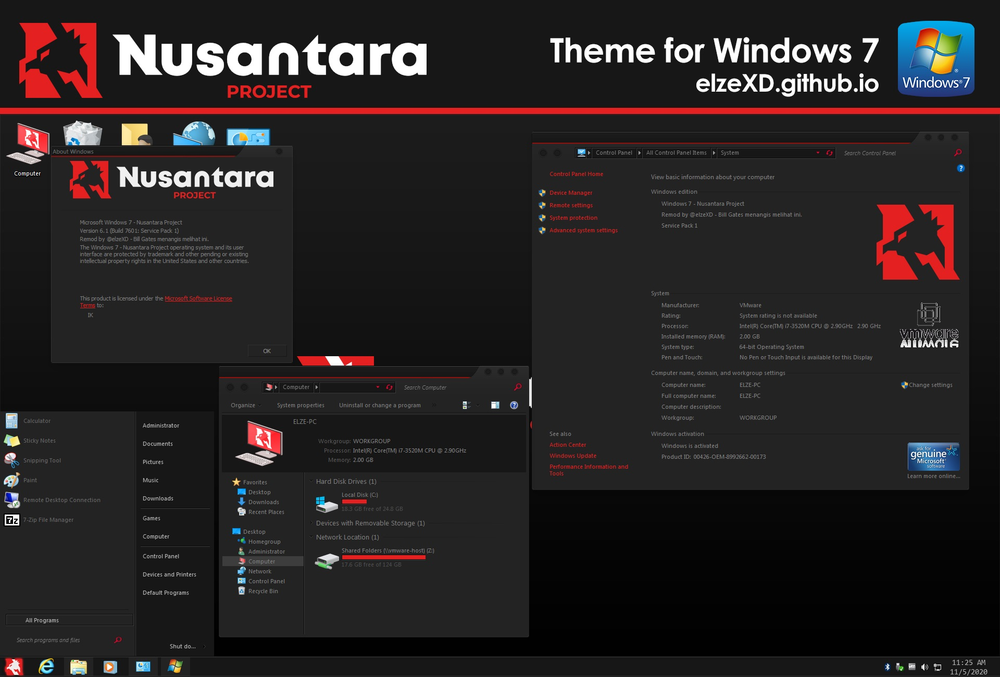

---

title: "[Windows 7 Theme] Nusantara Project"
desc: "Hello, this time I'll be sharing new theme, Nusantara Project for Windows 7. Inspired from the Custom ROM itself."
date: "2020-11-09"
cover: "./cover.jpg"
lang: "en"
tags:
  -  nusantara
  -  project
  -  theme
  -  windows 7

---

**Hello, this time I'll be sharing new theme, Nusantara Project for Windows 7. Inspired from the Custom ROM itself.**

**You all know this Custom ROM, right?**

**Sorry for long update, I'm so busy and my PC was broken, so I made this in my spare time using my old PC that still using Windows 7.**

**Since I joined and active in Android community for so long, I decided to put references to a custom ROM, called 'Nusantara Project' here.**

**Install guide and credits all in the video.**

Series: Nusantara Project

Platform: Windows 7

# Screenshots:

<a href="https://www.deviantart.com/elzepc/art/Windows-7-Theme-Nusantara-Project-860658056" class="btn">DOWNLOAD HERE</a>

<a href="https://youtu.be/4dsoTCOnWXU" class="btn">PASSWORD AND INSTALL GUIDE</a>

# Thank you for downloading! Keep supporting me for more releases!
