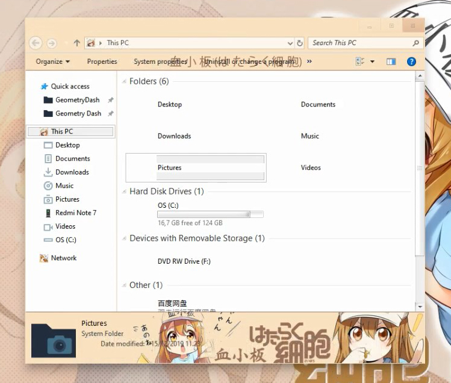
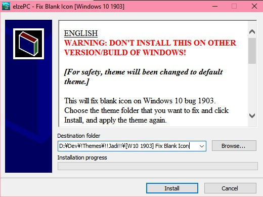
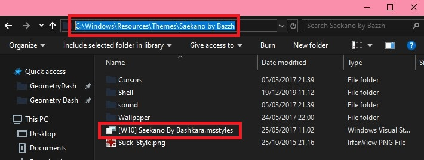
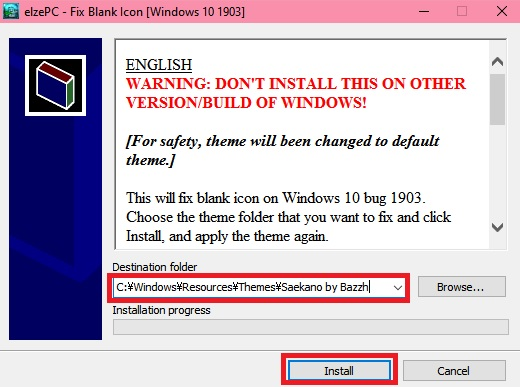

---

title: "Fix Blank Icon After Installing Windows 10 Theme (Build 1903 and up)"
desc: "If your icons went missing or your files turned into black, this article might help"
date: "2020-02-29"
cover: "./cover.jpg"
lang: "en"
tags:
  -  tutorial
  -  theme
  -  windows 10
  -  blank icon
  -  bug
  -  shellstyle

---

**Imagine, you've downloaded a nice theme, followed any kinds of tutorial, but ended up with this dark file like this?**

**Or this?**

Chill, you don't get any trouble at all. The problem here is the theme that doesn't suit your version.
But hey, it's also your mistake, you don't check the version first lol.
But calm down, it can be fixed! Wanna know how? Check this out.

## FIRST, DOWNLOAD THE REQUIRED FILES HERE!
## WILL BE UPDATED ACCORDING TO YOUR WINDOWS VERSION! CHECK IT USING WINVER

**If your build isn't available, just use the lates one here.**

<a href="http://bit.ly/2HYS9iJ" class="btn">DOWNLOAD (BUILD 1903)</a>

# Alright, I've downloaded it. How am I gonna use it?

Watch [this video](https://youtu.be/AL3ZKjA0W94) .

No quota? Alright then, proceed to read this article.

1. **Apply the standard theme first!**

   Obviously, how else are you going to see the files?

   Wait, how am I gonna apply it? I literally can't do anything.

   Simple! Press Win+R, then just type ***C:\Windows\Resources\Themes\aero.theme*** then *Enter*

2. **Open the previously downloaded file**

   Alright, there's a patch file there with .exe format, simply open it up.

3. **Asking for password, eh?**

   The password: ***elzeXD***

4. **Now what?**

   Now, you'll see this interface

   

   You see a box there, Destination Folder. Find the buggy theme.

   Usually located at ***C:\Windows\Resources\Themes***.

   

   Make sure in that folder there is *.msstyles*. That's the folder.

5. **What are we gonna do with it?**

   Just copy the path to the app, then click Install. Actually, you can browse the file manually.

   

6. **Done, now what?**

   Just re-apply the theme. As simple as that!

Alright, enough with the tutorial. If you have any question, feel free to hit me up on my social media located on the homepage.

Btw, these are the themes that I've used for testing:

- [Hataraku Saibou by EnjiRiz-PC](http://bit.ly/32pXUiT) (should be on Build 1809)
- [Saekano Flat by Suck-Style](http://bit.ly/37XQKna) (should be on Build 1607, geez that is old)
