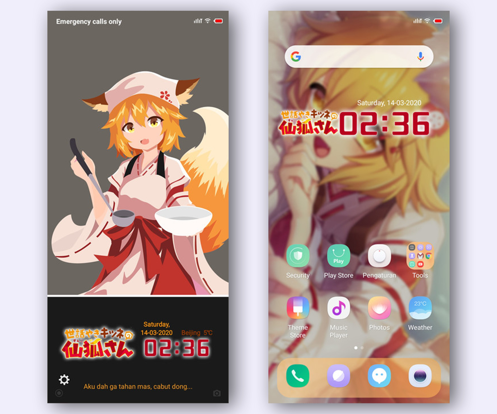
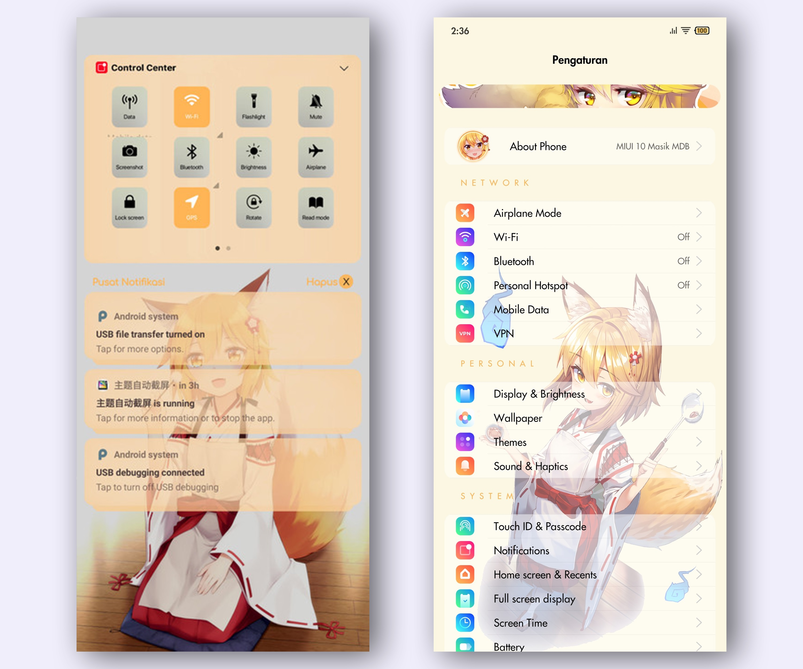
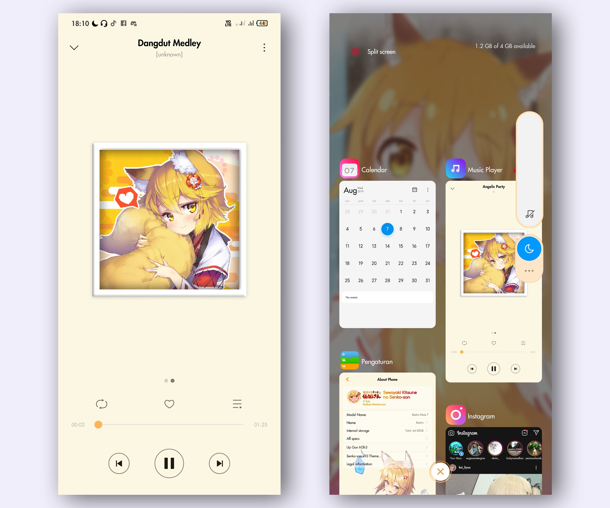
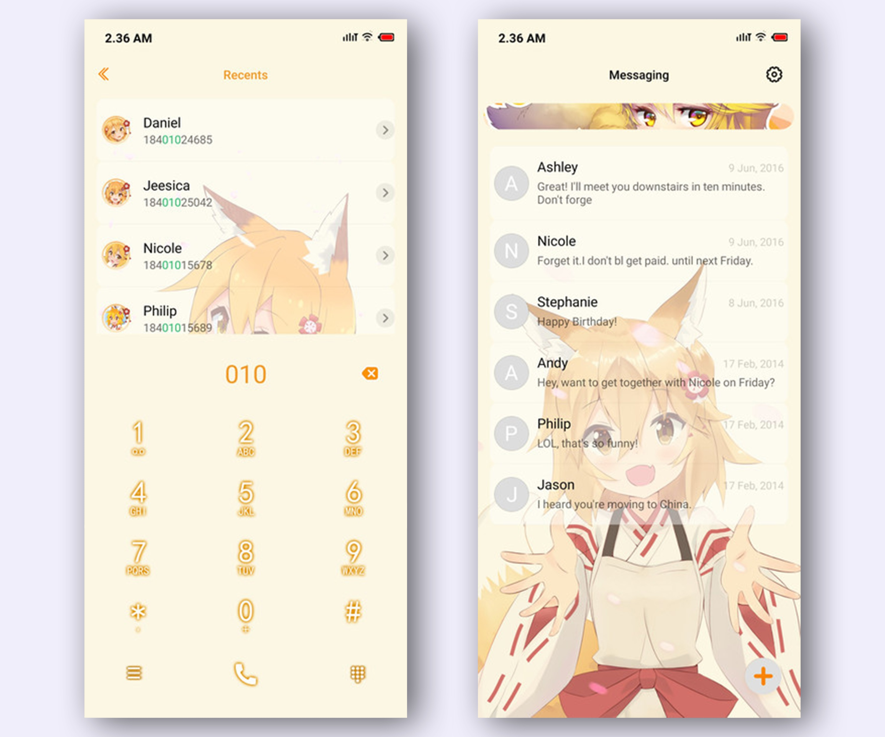

---

title: "[MIUI 10-11 Theme] Senko"
desc: ""
date: "2019-08-07"
cover: "./cover.jpg"
lang: "en"
tags:
  -  senko
  -  anime
  -  theme
  -  miui 11

---

**Hello, today I'll share my theme for MIUI 10 and 11. This time is Senko from the anime Sewayaki Kitsune no Senko-san.**
**Well, this is my first anime theme but published too late, after someone stole this theme and claiming its own.**

Chara: Senko
Series: Sewayaki Kitsune no Senko-san.
Platform: MIUI 10 and 11
Support: System, WhatsApp, YouTube

**This theme doesn't support Dark Mode**

[**Watch the video on my YouTube**](https://www.youtube.com/watch?v=YPgh2M6bLf4)

**Note: some elemets may be different with the original due to copyright.**

**Screenshots: (provided by Xiaomi)**

<a href="https://bit.ly/2IH6L6O" class="btn">MIUI 10 - DIRECT DOWNLOAD (MIRROR GDRIVE)</a>
<a href="https://bit.ly/3aLtydy" class="btn">MIUI 11 - DIRECT DOWNLOAD (MIRROR GDRIVE)</a>
<a href="http://zhuti.xiaomi.com/detail/81e5d818-91bb-4165-bcc3-f34f56059692" class="btn">MIUI 11 - THEME STORE (Region India)</a>
<a href="http://f6.market.xiaomi.com/download/ThemeMarket/0d7982431eff342da10251ff356085f3e7e98402c/Moona+Hoshinova+v11-1.0.0.0.mtz" class="btn">MIUI 11 - DIRECT DOWNLOAD (SERVER XIAOMI)</a>

# Thank you for downloading!
