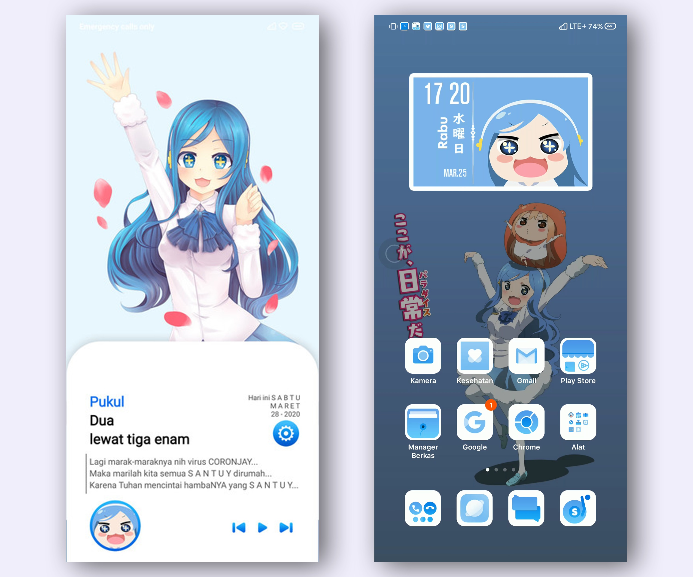
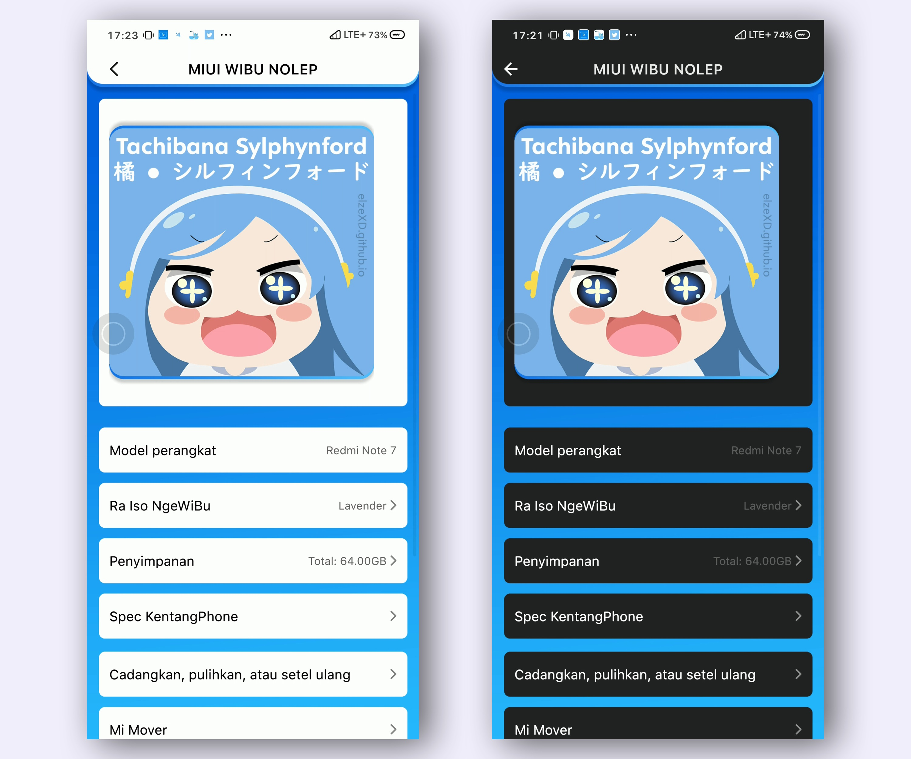
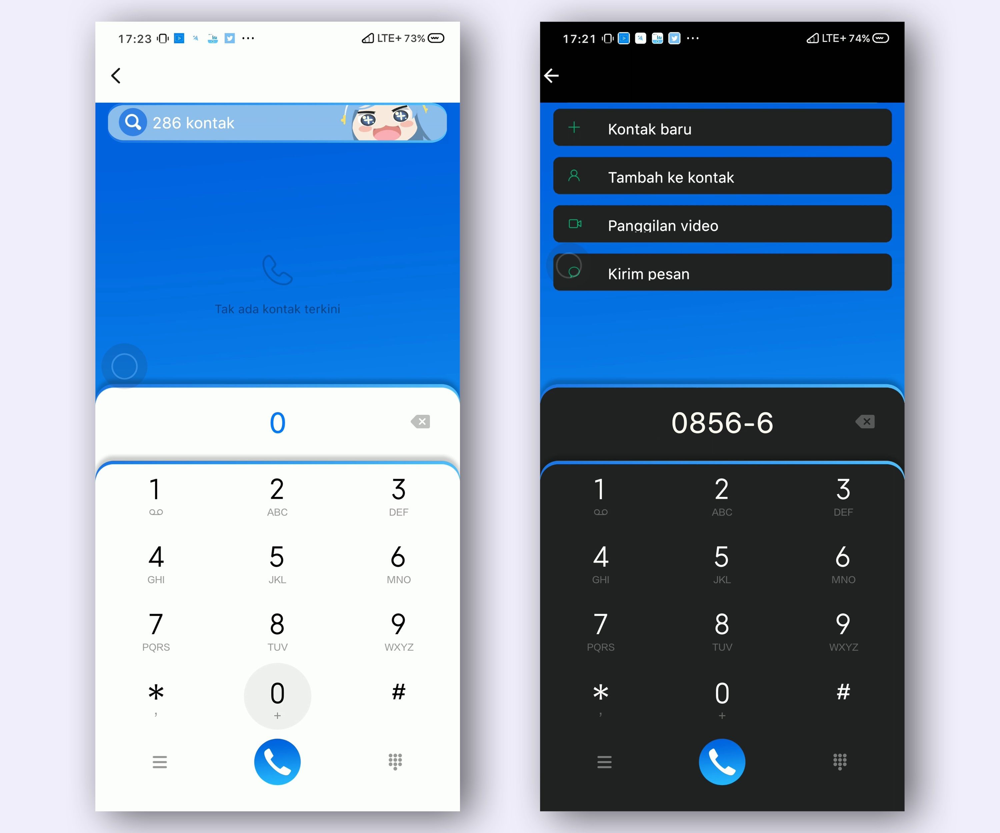
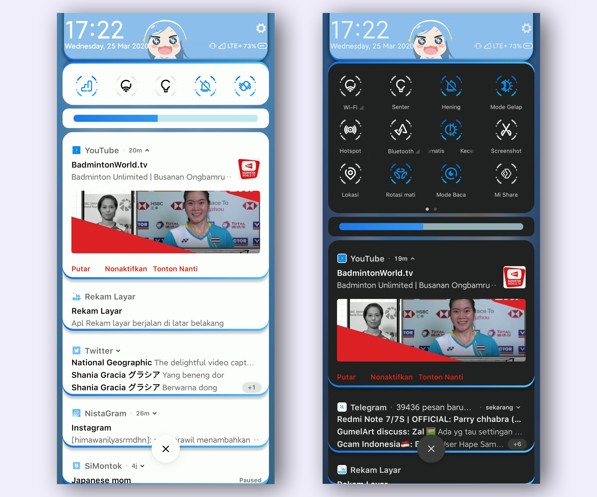

---

title: "[MIUI 11 Theme] Tachibana Sylphynford"
desc: "Hello, today I'll share my theme for MIUI 11. This time from a series Himouto! Umaru-chan, Tachibana Sylphynford. Support: System, WhatsApp, IG, YouTube"
date: "2020-03-26"
cover: "./cover.jpg"
lang: "en"
tags:
  -  tachibana sylphynford
  -  himouto umaru chan
  -  theme
  -  miui 11
---

**Hello, today I'll share my theme for MIUI 11. This time from a series Himouto! Umaru-chan, Tachibana Sylphynford.**

Chara: Tachibana Sylphynford

Series: Himouto! Umaru-chan

Platform: MIUI 11

Support: System, WhatsApp, IG, YouTube

**Support Dark Mode, you can try it yourself**

[**Watch the video on my YouTube**](https://www.youtube.com/watch?v=lC97vMN1Th4&t=152s)

# Screenshots

<a href="http://bit.ly/39nW6Zv" class="btn">DIRECT LINK (GDrive Mirror)</a>
<a href="http://zhuti.xiaomi.com/detail/da2f0240-b230-46ac-95fe-e7617d2cf377" class="btn">THEME STORE (Region India)</a>
<a href="http://f7.market.xiaomi.com/download/ThemeMarket/0ea66c55809a64d203032b0c0c554489c58851ab9/Sylphynford+v11-1.0.0.0.mtz" class="btn">DIRECT DOWNLOAD (SERVER XIAOMI)</a>

# Thank you for downloading!
