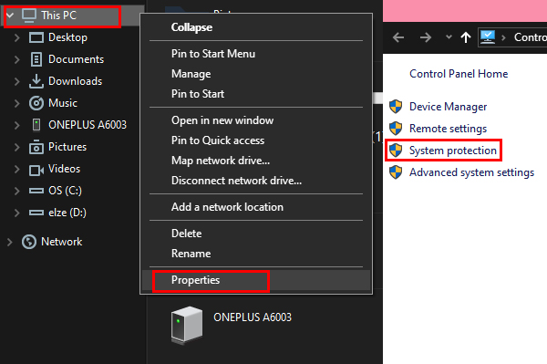
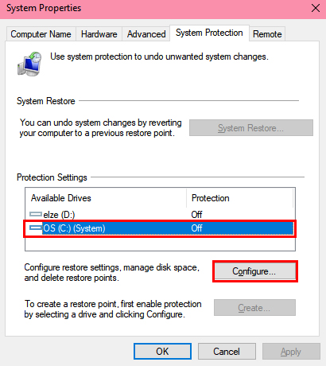
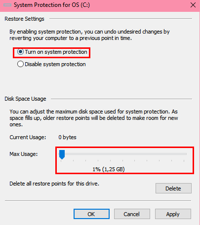
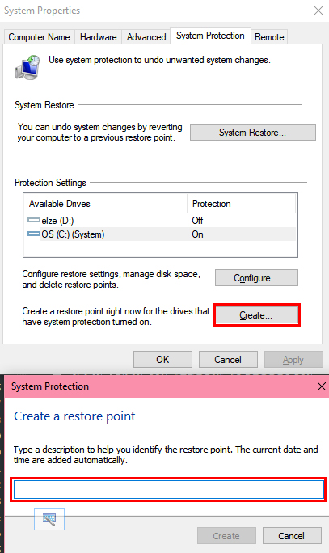
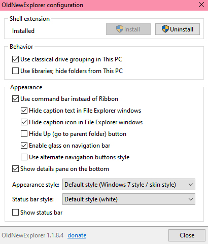
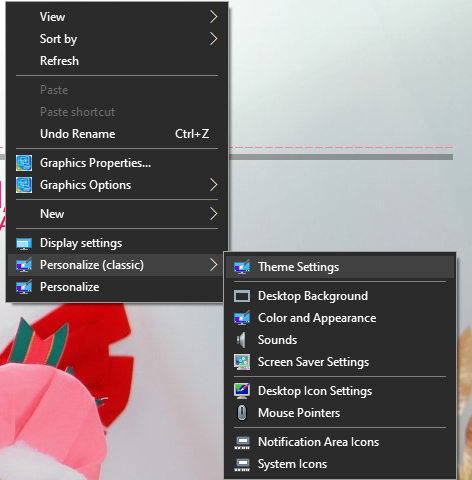
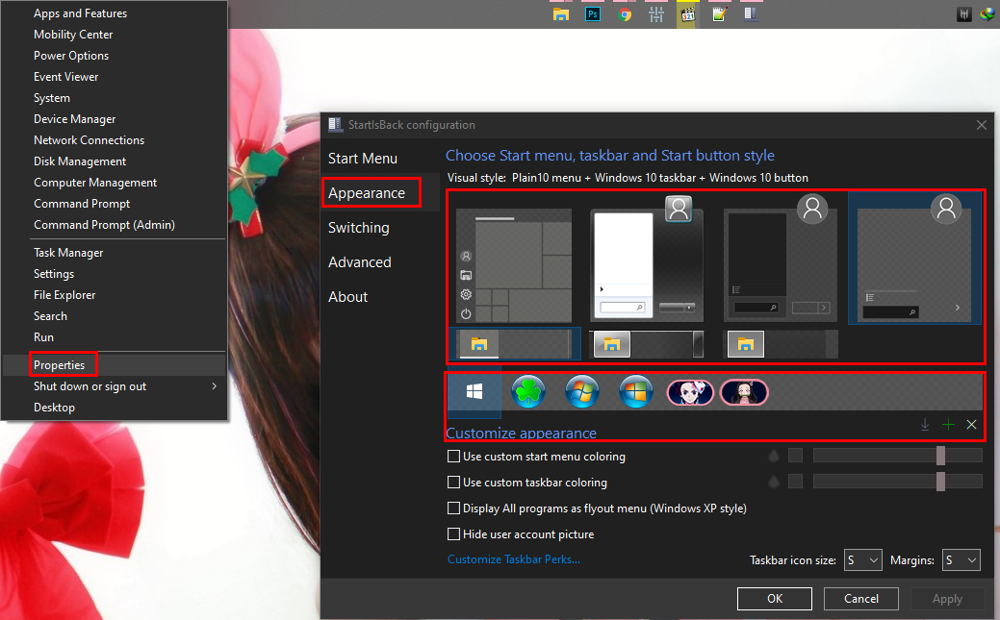

---

title: "Installing Theme on Windows 10 "
date: "2020-02-09"
desc: "Tutorial install tools untuk patching theme di Windows 10. Sisanya kata kata pengganti biar card elementnya ga ngebug ok oce."
cover: "./cover.jpg"
lang:
  -  en
tags:
  -  tutorial
  -  theme

---

## BEFORE YOU INSTALLING THE THEME, DOWNLOAD THE TOOLS HERE:

<a href="https://google.com" class="btn">DOWNLOAD HERE</a>

1. **MAKE A RESTORE POINT FIRST (VERY IMPORTANT, TO UNDO ALL CHANGES IN CASE AN ERROR OCCURRED)**

    - Right- click This PC, and then click Properties
ss
    - Click Advanced system settings

    - Click System Protection

   

    - Choose C drive

    - Click Configure

   

    - Click Turn on system protection

    - Adjust Disk Space Usage to 1% then click OK

   

   - Click on Create, and enter the name 'Install Theme' or anything else
   
   

   - Wait until it finishes and press OK.

2. **Ultra UXTheme Patcher, if you don't want to use it skip to number 3**

    Download [here](https://www.syssel.net/hoefs/software_uxtheme.php?lang=en), double-click it, follow the instructions, and restart your PC.

3. **Theme Signature Bypass**

    If you don’t want to use Patch, just install this and follow the instructions.

4. **Classic CP – to add menu Personalize Classic on Right- Click**

    - Double- click InstallClassicCP.reg

    - choose Yes.

5. **Classic Context Menu – to show effect of theme on Right- Click menu**

    - Double- click Enable Classic Context Menu in Windows 10.reg

    - choose Yes.

6. OldNewExplorer – to show effect of theme on Explorer and Control Panel

   **If you feel too difficult, skip to number 6**

    - Double- click OldNewExplorerCfg.exe

    - Don’t tick anything in "Behavior".

    - Tick everything in "Appereance" except Enable Glass on Navigation Bar.

    - Click Install, and choose Yes

   

    - Restart Explorer (if you don’t understand, just restart the PC)

7. **Ribbon Disabler – (use this if you are confused with OldNewExplorer) to show effect of theme on Explorer and Control Panel**

    - Open the folder x86 or x64 (Depends on your PC)

    - Double- click Ribbon disabler2.exe

    - Restart Explorer (if you don’t understand, just restart the PC)

8. **StartIsBack – to change Start Menu style**

    - Open Setup folder, open StartIsBackPlusPlus_setup.exe and install.

    - Open TrialReset folder, open StartIsBackTR.exe and choose Install Autoreset.

9. **Install The Theme**

    Follow the instruction. Password is in the installer!

10. **Change the theme**

    - Right- click on Desktop

    - Select Personalize (Classic) then Theme Settings

    

    - Choose the theme you have downloaded.\

    **To apply the theme in the Start Menu**
    
    - Right click on Start Button and seelct Properties.
   
    - Choose Appearance in the left side.
   
    - Choose which theme to apply.
   
    - If you wanna change the Start button, choose the available one or you can add it from file.
    
    

11. **If the icon blanks (Windows 10 1903 or newer)**

    - Follow [this tutorial](https://google.com).
