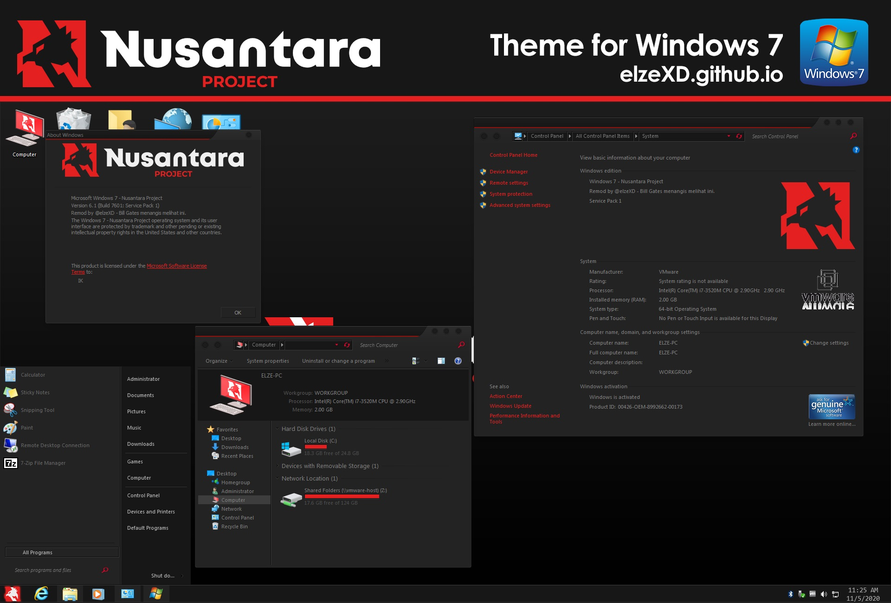

---

title: "[Windows 7 Theme] Nusantara Project"
desc: "Halo. Kali ini saya bakal share tema baru, yaitu Nusantara Project. Terinspirasi dari ROM yang lagi rame."
date: "2020-11-09"
cover: "./cover.jpg"
lang: "id"
tags:
  -  nusantara
  -  project
  -  theme
  -  windows 7

---

**Halo. Kali ini saya bakal share tema baru, yaitu Nusantara Project. Terinspirasi dari ROM yang lagi rame.**

**Mungkin semua sudah pada tau ini ROM aslinya kaya gimana, tema ini bertemakan hitam-merah, sama seperti ROM aslinya.**

**Sekalian curhat, beberapa bulan saya ga update karena sibuk, ditambah lagi PC yang biasa saya pake rusak, jadi terpaksa pake PC jadul untuk keperluan sehari-hari, yang kebetulan masih Windows 7, nah karena saya ga bisa ngapa-ngapain, saya gabut, yaudah saya bikin ini aja.**

**Cara instal dan credit semua ada di installer dan video YT**

Series: Nusantara Project

Platform: Windows 7

# Screenshots:

<a href="https://www.deviantart.com/elzepc/art/Windows-7-Theme-Nusantara-Project-860658056" class="btn">DOWNLOAD DISINI</a>

<a href="https://youtu.be/4dsoTCOnWXU" class="btn">PASSWORD DAN CARA INSTAL DI VIDEO</a>

# Thank you for downloading! Keep supporting me for more releases!
