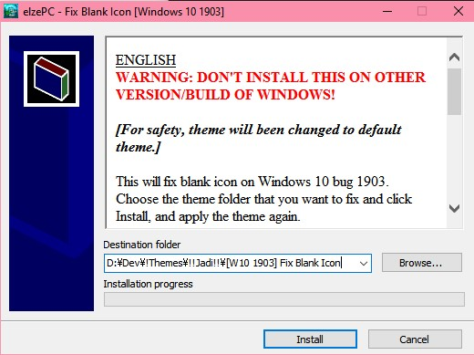
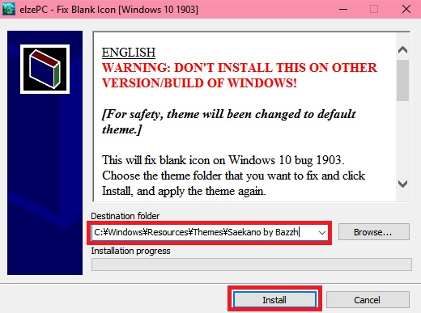

---

title: "Tutorial Fix Blank Icon Setelah Install Theme Windows 10 (Build 1903 and up)"
desc: "Jika setelah install theme, iconnya jadi hilang, atau file-file anda jadi gelap hitam, mungkin ini akan membantu."
cover: "./cover.jpg"
lang:
  - id
tags:
  -  tutorial
  -  theme
  -  windows 10
  -  blank icon
  -  bug
  -  shellstyle

---

**Bayangin, lu udah download tema bagus, udah ikutin tutorial segala macem, tapi file lu jadi gelap kaya gini?**

**Atau gini?**

Tenang bro, lu ga bakal kena kasus penggelapan kok, karena yang salah itu temanya yang gak sesuai sama versi yang lu punya.
Eh tapi lu juga salah sih, ga liat-liat versi :'v
Tapi tenang aja, bisa kok diperbaiki! Mau tau caranya? Liat aja disini.

## DOWNLOAD TERLEBIH DAHULU FILE-NYA DISINI!
## BAKAL DI UPDATE SESUAI VERSI WINDOWS! CEK DULU PAKE WINVER

**Kalau build lu gaada, pake aja yang paling baru disini**

<a href="http://bit.ly/2HYS9iJ" class="btn">DOWNLOAD (BUILD 1903)</a>

# Udah download nih, terus cara makenya gimana?

Lihat video [berikut ini](https://youtu.be/AL3ZKjA0W94) .

Gapunya kuota? Yaudah deh ini aja.

1. **Terapkan tema standar dulu!**

   Yaiyalah, lu mau liat filenya gimana coba?

   Lah trus cara nerapinnya gimana? Kan gua gabisa apa-apa?

   Gampang! Tekan Win+R, terus ketik aja ***C:\Windows\Resources\Themes\aero.theme*** lalu *Enter*

2. **Buka file yang didownload tadi**

   Nah, disitu ada file patch-nya, format .exe, nah lu buka aja tuh.

3. **Minta password ya?**

   Noh password: ***elzeXD***

4. **Terus apaan lagi?**

   Nah, lu bakal liat tampilan kayak gini:

   

   Nah kan ada kotak tuh, Destination Folder. Cari folder tema yang ngebug tadi.

   Biasanya sih ada di ***C:\Windows\Resources\Themes***.

   

   Pastikan di folder itu ada file *.msstyles*. Itu dia foldernya.

5. **Terus itu folder mau diapain?**

   Path-nya copy aja ke aplikasinya. Lalu tekan Install. Sebenarnya mau browse manual juga bisa sih.

   

6. **Udah nih, terus?**

   Yaudah terapin aja lagi temanya!

Sekian tutorial unfaedah ini, kalo mau nanya lagi silahkan ke kontak person yang ada di home yaa.

Btw, tema yang gua pake buat testing:

- [Hataraku Saibou by EnjiRiz-PC](http://bit.ly/32pXUiT) (seharusnya Build 1809)
- [Saekano Flat by Suck-Style](http://bit.ly/37XQKna) (seharusnya Build 1607, gila lawas bet)
