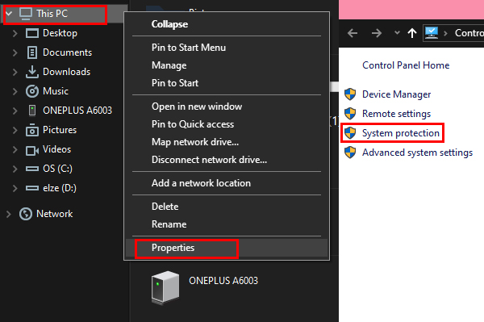
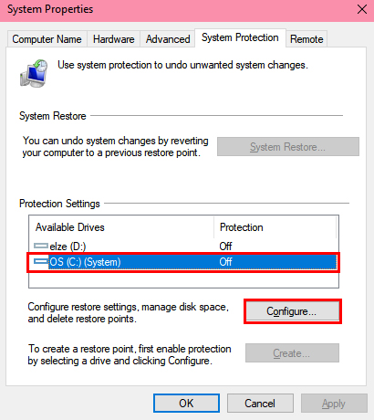
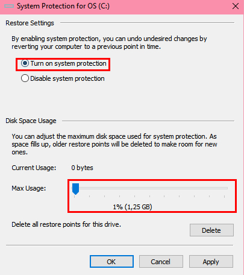
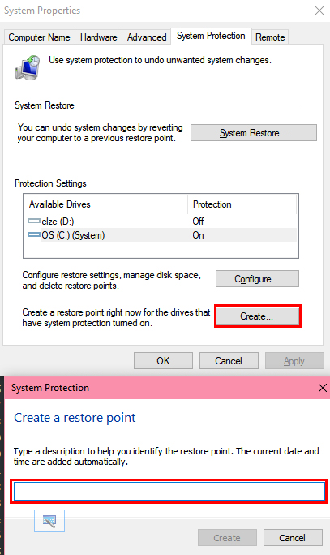
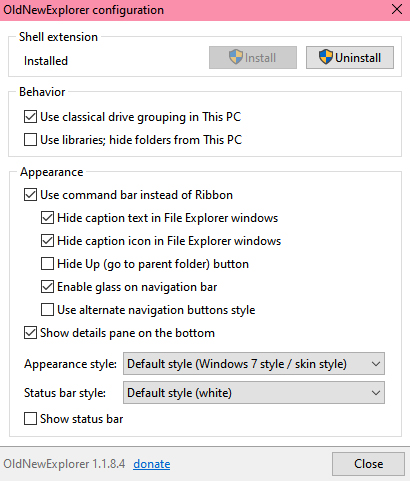
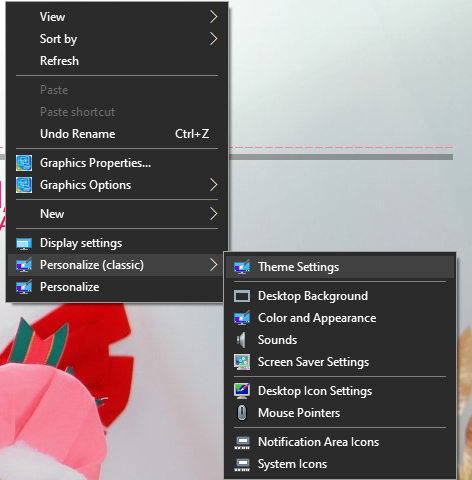
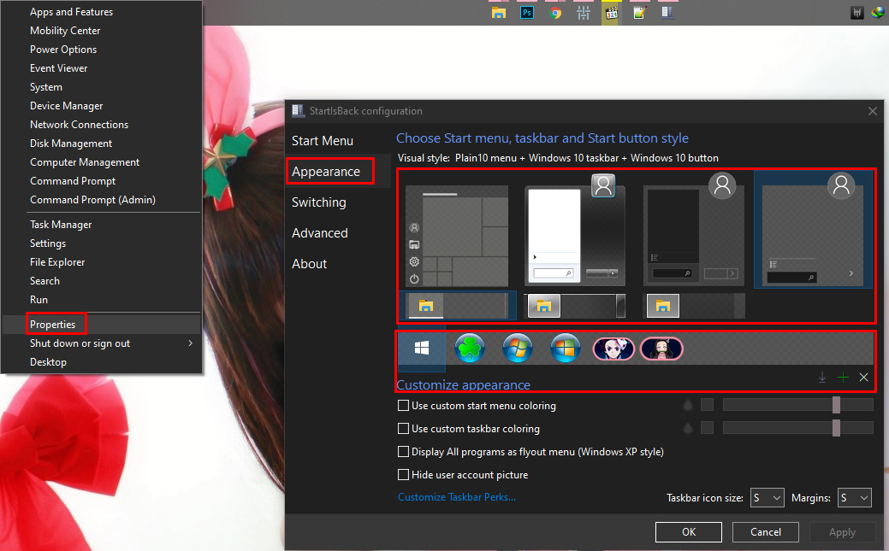

---

title: "Tutorial Install Theme Windows 10"
desc: "Tutorial install tools untuk patching theme di Windows 10. Wajib diikuti, agar tidak ada yang komplain 'Bang, ini kenapa gabisa?' dan lain-lain sebagainya."
date: "2020-02-29"
cover: "./cover.jpg"
lang:
  - id
tags:
  -  tutorial
  -  theme
  -  windows 10

---

## SEBELUM INSTALL THEME-NYA DOWNLOAD DULU BAHANNYA DISINI!
## Akan di-update sesuai build Windows yang terbaru!

<a href="http://bit.ly/2PpJWbq" class="btn">DOWNLOAD DISINI</a>

1. **BUAT RESTORE POINT TERDAHULU (SANGAT PENTING, UNTUK MEMBALIKKAN KEADAAN KALO TERJADI ERROR)**

   - Klik kanan *This PC*, lalu pilih *Properties*

   - Klik *System Protection*

   

   - Pilih *drive C*

   - Klik *Configure*

   

   - Klik *Turn on system protection*

   - Atur *Disk Space Usage* jadi *1%* lalu *OK*

   

   - Klik *Create*, dan beri name 'Install Theme' atau nama lain

   

   - Tunggu hingga selesai dan tekan *OK*.

2. **Ultra UXTheme Patcher**

   **Jika tidak punya kuota atau takut pakai ini, lanjut ke nomor 3.**

   Download [di sini](https://www.syssel.net/hoefs/software_uxtheme.php?lang=en), instal seperti biasa, lalu restart PC.

3. **Theme Signature Bypass**

   Jika tidak punya kuota atau takut patch, pakai ini. Cukup instal seperti biasa.

4. **Classic CP – digunakan untuk menambahkan pilihan Personalize Classic pada Klik Kanan**

   - Buka *InstallClassicCP.reg*

   - Pilih *Yes*.

5. **Classic Context Menu – digunakan untuk menampilkan efek tema pada saat klik kanan**

   - Buka *Enable Classic Context Menu in Windows 10.reg*

   - pilih *Yes*.

6. **OldNewExplorer – digunakan untuk menampilkan efek tema pada Explorer dan Control Panel.**

   **Jika merasa ribet, lanjut ke nomor 6.**

   - Buka *OldNewExplorerCfg.exe*

   - Ikuti pengaturan dibawah kalo bingung, atau atur sesuka hati.

   

   - *Restart Explorer* (kalau gak ngerti, restart aja komputernya)

7. **Ribbon Disabler – (kalo gak mau ribet pake OldNewExplorer, pake ini aja) digunakan untuk menampilkan efek tema pada Explorer dan Control Panel.**

   - Buka folder *x86* atau *x64*, sesuai dengan komputer anda

   - Klik 2x *Ribbon disabler2.exe*

   - *Restart Explorer* (kalau gak ngerti, restart aja komputernya)

8. **StartIsBack – digunakan untuk mengganti tampilan Start Menu.**

   - Buka folder *Setup*, buka *StartIsBackPlusPlus_setup.exe* lalu instal seperti biasa.

   - Buka folder *TrialReset*, buka *StartIsBackTR.exe* lalu pilih Install Autoreset.

   - Restart komputer anda.

9. **Install Tema**

   Instal seperti biasa. Password bervariasi, ada di installer!

10. **Ubah Tema**

    - Klik kanan di Desktop

    - Arahkan kursor ke *Personalize (Classic)* lalu pilih *Theme Settings*

	

    - Scroll ke bawah, pilih tema yang diinstal tadi.

	**Untuk menerapkan tema di Start Menu)**

    - Klik kanan tombol Start, lalu *Properties.*

    - Di bagian sebelah kiri, pilih *Appearance.*

    - Klik tampilan tema untuk menerapkan.

    - Jika ingin menambah tombol Start, pilih yang tersedia atau bisa ditambah dari file.

	

11. Jika icon blank

    - Ikuti tutorial [di sini](https://elzexd.github.io/releases/id/owo-patching/).
